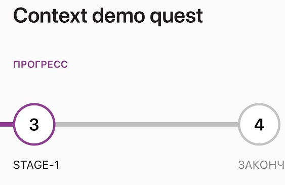

# Quest Actions

## Состояние прохождения квеста

Контекст, когда контент запущен для квеста, содержит объект QuestProgress. Это основной объект, описывающий пользователя, кампанию, квест, а также состояние прохождения квеста.

Список объектов QuestProgress в админ-панели:


Состояние прохождения формируется списком событий квеста и статус и состояние после последнеднего произошедшего события.
Для появления состояния прохождения, пользователь должен выполнить хотя бы одно действие с квестом (например, принять его).

Список событий квеста:


## Команды работы с квестом

### Событие квеста

**Описание:**

Добавляет событие квеста. Доступен перевод статуса квеста, перевод квеста на другой этап.

`window.story.questProgress.transfer(model)`

 **Параметры:**

* **status*** - `enum`. Accept | Action | Success | Fail | Decline | Reject;
* **title*** - `string`;
* **message** - `string`;
* **value** - `string`;
* **goal** - `boolean`;
* **stageId** - `string`;
* **PointsTransfer** - `object`. Одновременно с событием квеста, можно создать событие перевода баллов. Модель из команды "Перевод баллов".

**Запрос:**

```js
story.questProgress.transfer({
    title: 'Вы перешли на этап Stage-1',
    message: 'Вам начислены баллы',
    status: 'Action',
    value: 'some value',
    goal: true,
    PointsTransfer:{
        operationType: 'Approved',
        direction: 'Forward',
        title: 'Начисление баллов',
        message: 'Успешное прохождение этапа квеста',
        value: 10,
    }
});
```

Список событий можно увидеть, развернув QuestProgress в админ-панели:


В приложении сменился этап квеста:



### Перевод баллов

**Описание:**

Начисляет баллы от кампании пользователю и обратно.

`window.story.questProgress.transferPoints(model)`

 **Параметры:**

* **operationType*** - `enum`. Accepted | Reserved | Canceled | PartialAccepted | Reject | Approved | Review;
* **direction*** - `enum`. Forward | Backward;
* **title*** - `string`;
* **message** - `string`;
* **value*** - `number`.

**Запрос:**

```js
story.questProgress.transferPoints({
        operationType: "Accepted",
        direction: "Forward",
        title: "transfer points title 2",
        message: "transfer points message 2",
        value: 10
});
```

### Кампания

**Описание:**

Добавляет пользователя в кампанию по идентификатору.

`window.story.questProgress.grantCampaign(model)`

 **Параметры:**

* **campaignId*** - `string`.

**Запрос:**

```js
story.questProgress.grantCampaign({
    campaignId: "dbd24451.8020f915-cd52-412b-99f6-8fbd3c9936ec"
});
```
