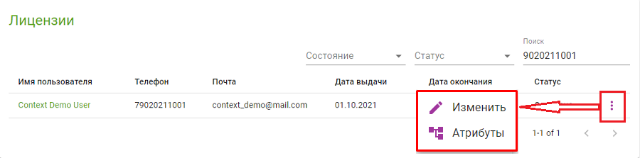

# Атрибуты

## Общее описание

Атрибуты это js объект, часть контекста.

Работает как хранилище данных, обладает иерархичной структурой, хранится локально на устройстве и синхронизируется с сервером при наличии интернет-соединения.

В завистимости от роли контента, набор объектов атрибутов могут различаться.

Атрибуты лицензии в админ-панели:



Поддерживается 2 способа изменения атрибутов - прямое изменение полей объекта и вызов метода, инициирующего изменения.

В атрибутах доступны следующие типы:

* **number** - `+-Infinite` и `NaN` не поддерживаются;
* **string**;
* **boolean**;
* **null** - отсутствие значения;
* **object** -  на стороне сервера атрибуты имеют иерархичную структуру, object рассматривается как корень для вложенных атрибутов.

Коллекции (массивы) не поддерживаются. Для реализации коллекции можно использовать объект с произвольными перечисляемыми ключами.

## Атрибуты в контексте квеста

При запуске контента для квеста объект window.story содержит, помимо прочего, следующие объекты атрибутов:

* **licenseAttributes**. Атрибуты пользователя;
* **campaignAttributes**. Атрибуты кампании;
* **questAttributes**. Атрибуты квеста.
* **questProgressAttributes**. Атрибуты состояния прохождения квеста.

### Варианты работы

#### Изменение полей объекта

При прямом изменении полей контекста, изменения применяются сразу, например код

`window.story.licenseAttributes.loginCount = 5`

сразу после вызова устанавливает поле контекста `loginCount` в 5. Реальные изменения и применение значения на сервере будут выполнены позже.

#### window.story.SetStory()

При вызове метода установки контекста `window.story.SetStory`.
Первым параметром указывается набор ключей объектов, требующих изменения (частичный новый объект).

Например, код

```js
window.story.setStory({
    licenseAttributes: {
        loginAttempts: {
            success: 3
        }
    },
    questProgressAttributes: {
        lastRetry: 'tomorrow'
    },

})
```

вызовет изменения полей

`story.licenseAttributes.loginAttempts.success = 3`

 и

`story.questProgressAttributes.lastRetry = 'tomorrow'`

Для удаления атрибутов доступен метод `window.story.removeStoryProp`. Параметром передается полный путь атрибута.

Например, код

```js
window.story.removeStoryProp('licenseAttributes.loginAttempts.success');
```

Вызовет удаление поля `success` объекта `loginAttempts` в атрибутах лицензии.

При этом, изменения в объекте window.story будут отражены после обработки вызова приложением.

Атрибуты могут изменяться как контентом, так другими приложениями. Для оповещения контента об изменениях, контент может подписаться на событие `window.onStoryChange`:

```js
story.onStoryChange = () => {
    alert(story.licenseAttributes, null, 2);
};
```

Метод `onStoryChange` будет вызван при любом изменении любого объекта контекста.
